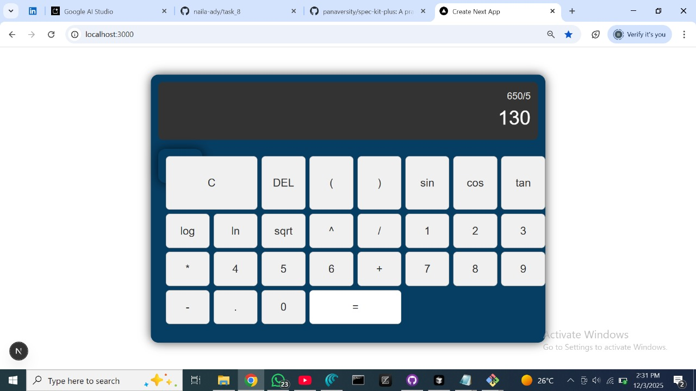

# Scientific Calculator

This is a scientific calculator application built with Next.js, React, and TypeScript. It supports basic arithmetic operations, scientific functions, and robust error handling.Using Speckitplus

## SpecKitPlus Phases

### 1. /constitution
- Design a scientific calculator.
- Rules:
  - Perform calculations correctly.
  - Support basic and some scientific operations.
  - Show clear error messages for invalid input.

### 2. /specify
- Goal: Make a scientific calculator with a Next.js UI.
- Requirements:
  - Buttons for numbers, basic operators, and a few scientific functions (power, sqrt, log, sin, cos, tan).
  - Show the current expression and the result.
  - Evaluate the expression safely when `=` is pressed.

### 3. /plan
- Create a Next.js project and a calculator page.
- Build the UI:
  - Display area for expression and result.
  - Keypad with buttons for digits, operators, and scientific functions.
- Implement expression evaluation and connect it to the `=` button.

### 4. /tasks
1. Set up the Next.js app and main calculator page.
2. Implement calculator UI components (Display, Keypad, Buttons).
3. Implement and wire up expression evaluation logic.

### 5. /implement
- Implemented all three tasks:
  - Next.js project created and running.
  - Calculator UI built with React components.
  - Expression evaluator added and connected to the UI.

## Tech Stack

- **Framework:** Next.js (App Router)
- **Language:** TypeScript (or JavaScript, depending on setup)
- **UI:** React components for display and keypad
- **Logic:** Custom expression evaluation (no unsafe `eval`)


## Features

*   **Basic Operations**: Addition, subtraction, multiplication, division.
*   **Scientific Functions**: Sine, cosine, tangent, logarithm (base 10), natural logarithm, square root, power.
*   **Parentheses Support**: For complex expressions.
*   **Error Handling**: Clear error messages for invalid inputs (e.g., division by zero, square root of negative numbers).
*   **Responsive UI**: Optimized for both desktop and mobile devices.

## Supported Functions and Constants

*   `+`, `-`, `*`, `/`: Basic arithmetic
*   `^`, `pow(base, exp)`: Power (e.g., `2^3` or `pow(2,3)` for 2 cubed)
*   `sin(x)`, `cos(x)`, `tan(x)`: Trigonometric functions (input in radians)
*   `log(x)`: Logarithm base 10
*   `ln(x)`: Natural logarithm (base e)
*   `sqrt(x)`: Square root
*   `pi`: Mathematical constant Pi
*   `e`: Mathematical constant e

## Example Expressions

*   `2 + 2`  -> `4`
*   `(3 * 4) - 2` -> `10`
*   `sin(pi / 2)` -> `1`
*   `log(100)` -> `2`
*   `sqrt(16)` -> `4`
*   `2^3` -> `8`
*   `10 / 0` -> `Error: Division by zero`
*   `sqrt(-1)` -> `Error: Square root of negative number`

## How to Run the Application

1.  **Navigate to the `frontend` directory**:
    ```bash
    cd frontend
    ```
2.  **Install dependencies**:
    ```bash
    npm install
    ```
3.  **Run the development server**:
    ```bash
    npm run dev
    ```
4.  Open [http://localhost:3000](http://localhost:3000) in your browser to see the calculator.


5. ## Screenshots of calculator operations
[](assets/img1.jpg)

[](assets/img2.jpg)

[](assets/img3.jpg)

[](assets/img4.jpg)
